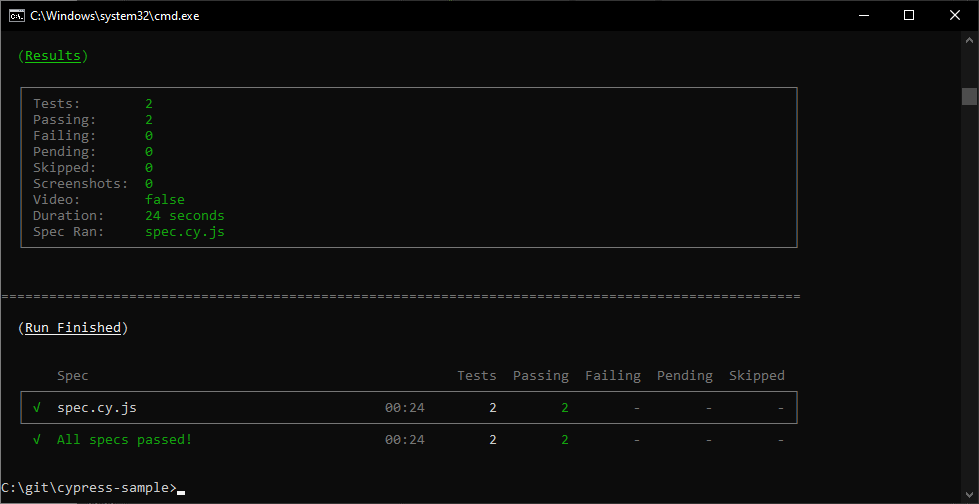

# cypress-sample

Projeto exemplo de utilização do Cypress para automação web de um site.

# Dependências necessárias

Cypress
VS Code

# Execução dos testes

Para rodar os testes, execute o seguinte comando:

```
npx cypress run **/cypress/e2e/spec.cy.js
```

Tendo como objetivo o seguinte resultado:


